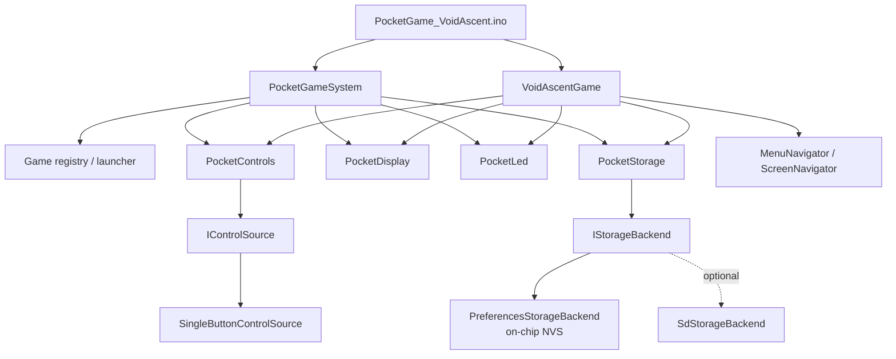
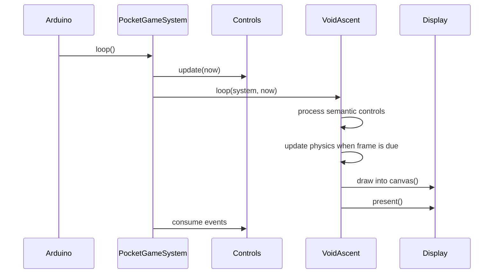

# Architecture

## Ownership boundary

`PocketGameSystem` owns hardware-facing services and the active storage namespace. A game receives the system by reference and accesses only stable APIs.

`VoidAscentGame` owns only its domain:

- missions and compile-time validation
- physics and timing
- particles, fragments, rocket geometry and drawing
- scoring and progression decisions
- splash, briefing, flight and result presentation

## Main loop

